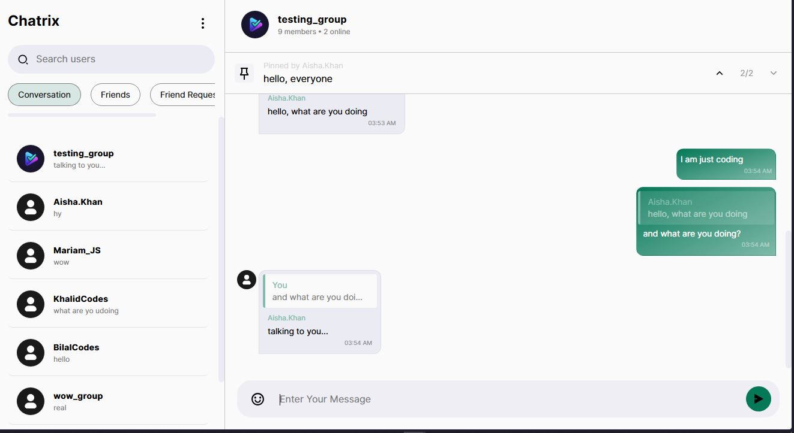
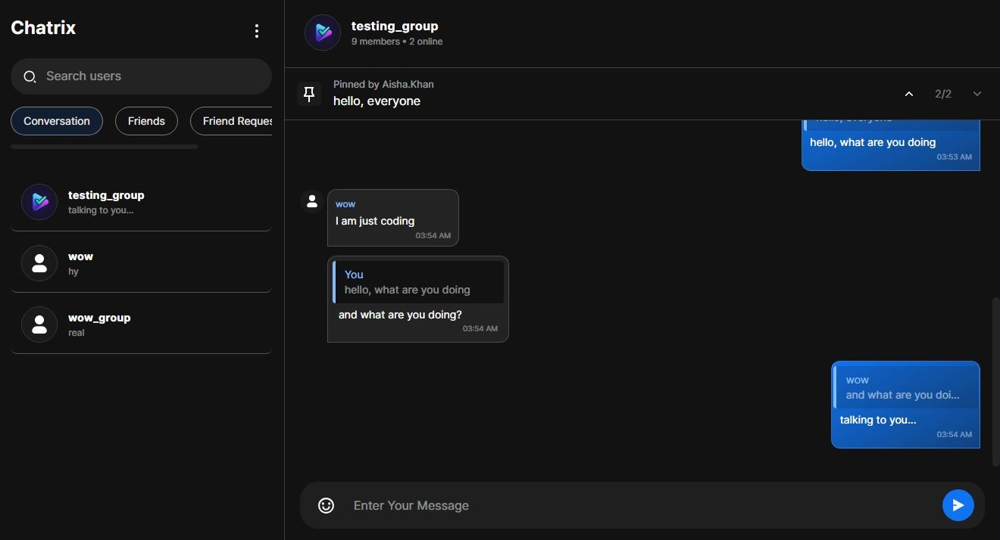
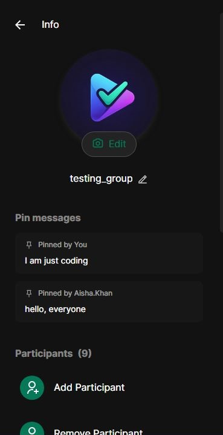
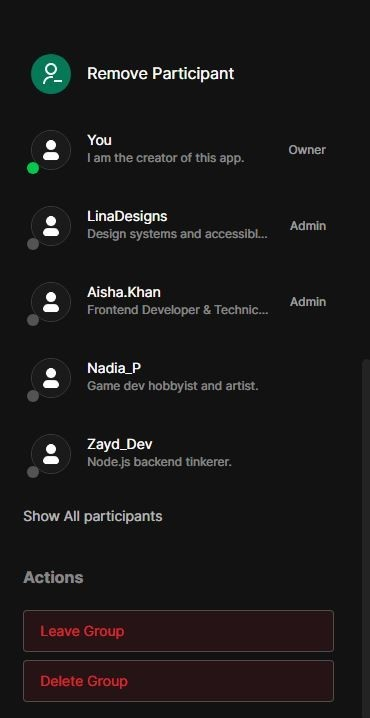
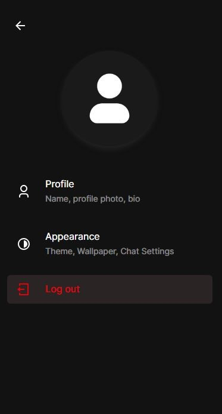

# Chatrix v0.2.0

## Preview

<p align="center">
  
  
</p>

**Chatrix is a full-stack real-time chat application built with React, Express, MongoDB, and Socket.IO. It features private and group messaging, friend management, live presence, typing indicators, message interactions, and role-based group management. Chatrix is a personal learning project focused on building a scalable, production-style real-time messaging application while following clean architecture and modern full-stack development practices.**

## Features

**🔐 Authentication**

- Email OTP verification
- Forgot password with email link
- JWT authentication
- HTTP-only cookie sessions
- Secure authentication flow
- Profile management

**👥 Friendship**

- Friendship System
- Username search
- Friend requests
- Accept / Reject requests
- Remove friends
- Block / Unblock users
- Real-time online/offline presence

**💬 Messaging**

- Real-time messaging (Socket.IO)
- Typing indicators
- Reply to messages
- Edit messages
- Delete messages
- Forward messages
- Pin messages
- Copy message
- Message date separators
- Emoji support
- Conversation synchronization
- Presence in conversation header

**👨‍👩‍👧‍👦 Group Chats**

- Create groups
- Rename groups
- Update group photo
- Add participants
- Remove participants
- Leave groups
- Owner transfer
- Promote/Demote admins
- Delete groups
- Conversation information
- Persistent real-time system messages

**⚙️ Settings**

- Update profile
- Theme customization
- Accent color customization

**⚡ Technical Highlights**

- Feature-based folder structure
- Modular React components
- Organized Socket.IO handlers
- Event-driven real-time architecture
- Zustand slices
- REST API
- MongoDB data models
- Real-time synchronization

## Tech Stack

| Category         | Technology                |
| ---------------- | ------------------------- |
| Frontend         | React, Vite, Tailwind CSS |
| Backend          | Node.js, Express.js       |
| Database         | MongoDB, Mongoose         |
| Realtime         | Socket.IO                 |
| State Management | Zustand                   |
| Authentication   | JWT, Cookies              |
| Image Storage    | Cloudinary                |
| Email            | Nodemailer                |
| Version Control  | Git & GitHub              |

## Screenshots

### Private Chat

<p align="center">
  
</p>

### Conversation Info

<p align="center">
  
  
</p>

### Settings

<p align="center">
  
</p>

## 🏗 Project Structure

```text
chatrix/
├── backend/
│   ├── src/
│   │   ├── controllers/
│   │   ├── middleware/
│   │   ├── models/
│   │   ├── routes/
│   │   ├── socket/
│   │   └── utils/
│   └── ...
├── frontend/
│   ├── src/
│   │   ├── components/
│   │   ├── features/
│   │   ├── hooks/
│   │   ├── pages/
│   │   ├── socket/
│   │   ├── store/
│   │   └── utils/
│   └── ...
├── docs/
│   └── images/
├── LICENSE
├── README.md
└── .gitignore
```

## 🚀 Getting Started

### Clone and enter in the repository

```bash
git clone https://github.com/muhammadazandev/chatrix.git
cd chatrix
```

### Install dependencies

```bash
# Terminal 1
cd backend
npm install

# Terminal 2
cd frontend
npm install
```

### Configure environment variables

Create `.env` files for both frontend and backend.

### Start the development servers

Frontend

```bash
npm run dev
```

Backend

```bash
npm run dev
```

## 🔐 Environment Variables

### Backend

```env
PORT=
CLIENT_URL=
MONGODB_URI=
SMTP_HOST=
SMTP_PORT=
SMTP_USER=
SMTP_PASS=
SMTP_SECURE=
NODE_ENV=
JWT_ACCESS_SECRET=
JWT_REFRESH_SECRET=
CLOUDINARY_CLOUD_NAME=
CLOUDINARY_API_KEY=
CLOUDINARY_API_SECRET=
```

### Frontend

```env
VITE_API_URL=
```

## 📝 Notes

- **Cloudinary PDF delivery:** Cloudinary may restrict public delivery of PDF and certain document types depending on your account configuration. If PDF messages cannot be opened or forwarded and Cloudinary returns **HTTP 401**, enable PDF delivery in your Cloudinary account or contact Cloudinary support.

## 📄 License

This project is licensed under the MIT License.
